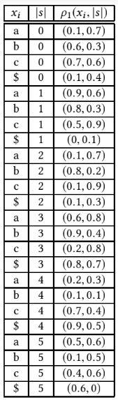

# LSH used in Approximate Similarity Search Under Edit Distance Using Locatlity Sensitive Hashing
## Define Hash functions
We define hash functions $h_\rho (x)$ using an underlying function $\rho$ \
So if $\rho _1 = \rho _2$ then $h_{\rho1} (x) = h_{\rho2} (x)$ \

## Calculating the hashed string
:::columns

:::{.column}
\
$p=1/8$ \
$p_a=\sqrt{p/1+p}=1/3$ \
$p_r=\sqrt{p}/(\sqrt{1+p}-\sqrt{p})=1/2$ \
<!-- :::
:::{.column width=85%} -->
\
$(r_1,r_2) \leftarrow \rho_1(x_i,|s|)$ \
\
<!-- $r_1\leq p_a \ \ \ \ \ \ \ \ \ \ \implies \textbf{hash-insert},\ append\ \bot$ \ -->
$r_1\leq p_a \implies \textbf{hash-insert},\ append\ \bot$ \
\
$r_1>p_a, r_2\leq p_r \implies \textbf{hash-replace},\ append\ \bot\ \&\ i++$ \
\
$r_1>p_a, r_2>p_r \implies \textbf{hash-match},\ append\ x_i\ \&\ i++$ \

:::

:::{.column}
{#id .class height=80%}
:::

:::

## Calculating the hashed string

::: columns

:::{.column width=100%}

$\textbf{x=abc}$ \
$x_1=a,\ s="", \rho_ 1(a,0)=(0.1,0.7)$ \ 
$\implies r_1\leq p_a \implies \textbf{hash-insert}$ \
$x_1=a,\ s="\bot", \rho_ 1(a,1)=(0.9,0.6)$ \
$\implies r_1>p_a,\ r_2>p_r \implies \textbf{hash-match}$ \
$x_2=b,\ s="\bot a", \rho_ 1(b,2)=(0.8,0.2)$ \
$\implies r_1>p_a,\ r_2\leq p_r \implies \textbf{hash-replace}$ \
$x_2=b,\ s="\bot a\bot", \rho_ 1(b,3)=(0.9,0.4)$ \
$\implies r_1>p_a,\ r_2\leq p_r \implies \textbf{hash-replace}$ \
...
:::

:::

## The final hash values

:::columns

::: {.column width=30%}
\rightline{$x=abc$} 
\rightline{$y=bac$} 
\rightline{$z=cba$}

:::
:::{.column width=70%}

$h_{\rho1}(x)=\bot a \bot\bot\bot\bot$ \
$h_{\rho1}(y)=\bot a \bot\bot\bot\bot$ \
$h_{\rho1}(z)=c \bot\bot a$ \
:::
:::
### x & y have matching hash strings

## Analysis of the hash values

:::columns

:::{.column}
$\textbf{x=abc}$ \

\begin{tabular}{ |c|c|c| }
\hline
$x_{i(x,k,\rho)}$&$|s|$&$\tau _k(x,\rho)$ \\
\hline\hline
a    &0     &hash-insert \\
\hline
a    &1     &hash-match  \\
\hline
b    &2     &hash-replace \\
\hline
c    &3     &hash-insert \\
\hline
c    &4     &hash-replace \\
\hline
\$    &5     &hash-replace \\
\hline
\end{tabular}
:::

:::{.column}
$\textbf{y=bac}$ \

\begin{tabular}{ |c|c|c| }
\hline
$y_{i(y,k,\rho)}$&$|s|$&$\tau _k(y,\rho)$ \\
\hline\hline
b    &0     &hash-replace \\
\hline
a    &1     &hash-match  \\
\hline
c    &2     &hash-insert \\
\hline
c    &3     &hash-insert \\
\hline
c    &4     &hash-replace \\
\hline
\$    &5     &hash-replace \\
\hline
\end{tabular}
:::

:::

## Analysing Grid Walk

:::columns

:::{.column width=100%}
When $x_{i(x,k,\rho)}\neq y_{i(y,k,\rho)}$
\begin{tabular}{ |c|c|c| }
\hline
$\tau _k(x,\rho)$ & $\tau _k(y,\rho)$ & $g_k (x,y,\rho)$ \\
\hline \hline
hash-replace & hash-replace & replace \\
\hline
hash-replace & hash-insert & delete \\
\hline
hash-insert & hash-replace & insert \\
\hline
hash-insert & hash-insert & loop \\
\hline
hash-match & - & stop \\
\hline
- & hash-match & stop \\
\hline
\end{tabular} \

When $x_{i(x,k,\rho)}=y_{i(x,k,\rho)}$
\begin{tabular}{ |c|c|c| }
\hline
$\tau _k(x,\rho)$ & $\tau _k(y,\rho)$ & $g_k (x,y,\rho)$ \\
\hline \hline
hash-match & hash-match & match \\
\hline
hash-replace & hash-replace & match \\
\hline
hash-insert & hash-insert & loop \\
\hline
\end{tabular}

:::

:::

## Gridpath for x and y

::: columns

:::{.column width=100%}
\begin{tabular}{|c|c|c|c|c|}
\hline
x&$\tau _k(x,\rho 1)$&y&$\tau _k(y,\rho 1)$&$g_k (x,y,\rho 1)$\\
\hline \hline
a & hash-insert & b & hash-replace & insert \\
\hline
a & hash-match & a & hash-match & match \\
\hline
b & hash-replace & c & hash-insert & delete \\
\hline
c & hash-insert & c & hash-insert & loop \\
\hline
c & hash-replace & c & hash-replace & match \\
\hline
\$ & hash-replace & \$ & hash-replace & match \\
\hline
\end{tabular}
:::

:::

## Transformations

Greedily apply sequence of edits (remove match and loop) to x. \
So for the above case, we would have insert(b) at a and delete at b.

## Bounds of Collision Probabilities

Lemma 14: If $x$ and $y$ satisfy $ED(x,y) \leq r$, then 
$Pr_\rho (h_\rho (x)=h_\rho(y)) \geq p^r-2/n^2$. \
\
Lemma 15: If $x$ and $y$ satisfy $ED(x,y) \geq cr$, then 
$Pr_\rho (h_\rho (x)=h_\rho(y)) \leq (3p)^cr$. \
\
This gives us $(r, cr, p^r-2/n^2, (3p)^cr)$-sensitive family.